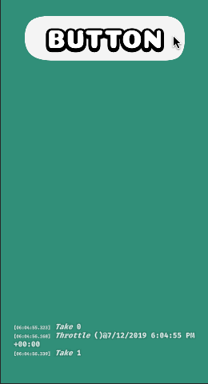
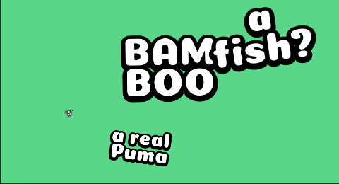
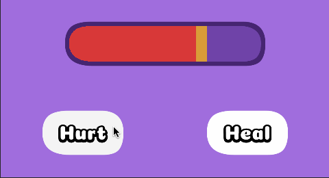
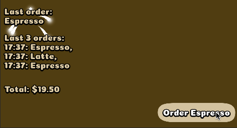
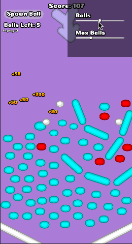

# :wave: hi

This project has some examples to play around with and get familiar with Rx in Unity:

## [Sandbox](Assets/Examples/Sandbox/)

A super bare bones scene with heavily commented files to show the basics of streams and Subjects.

## [Puma](Assets/Examples/SomewhatFancierExample1/)

This example shows the progress of a fictitious Puma progressing trough a fictitious world.

The `PumaProgress` is used to calculate a position and to trigger animations along the way. The value can be changed in the inspector.

The animations `ProgressProp` convert the progress to a target scale and only start a new animation when the in range boolean value changes (using `DistinctUntilChanged`).

## [HealthBar](Assets/Examples/SomewhatFancierExample2/)

This example shows a slow health bar and commands.

The health bars use a single health value as input. The slow part just uses `Throttle` to delay the animation until it is not changing for a short while.

The normalized health value is calculated using the reactive max health property, so when either value changes, the normalized values changes with it.

The commands use the same health source to determine their can execute state.

Note that you can also change the health value in the inspector directly and everything still updates accordingly.

## [Coffee](Assets/Examples/SomewhatFancierExample3/)

This example shows the setup of the worlds weirdest coffee bar. Random coffee orders are generated at intervals or at manual request.

The total cost of all emitted orders is calculated dynamically using the `Scan` operator. And it combines multiple input streams (Intervals and a manual subject) to generate a healthy coffee order stream.

Using the `OfType<TSource, TOutput>` it filters on the only correct coffee choice and show a little effect when that is ordered.

A very important thing to get your head around is the `Share` operator on the intervals in `SomewhatFancierExample3`. Without it each subscription would initiate a new, fresh set of intervals, starting at the moment of subscription. Even worse, since we're selecting random coffees from the interval, without it each subscriber would get a different stream of coffees.

Start with the {Sandbox](Assets/Examples/Sandbox/) example, where the basics can be explored. After that check the somewhat fancier examples: ,  and . Each example has an accompanying README file with more info.

## [Peggle-ish](Assets/Examples/PeggleRx/)

This example demonstrates different, not necessarily the best, ways of using observables.

# :link: links

- https://github.com/neuecc/UniRx
- https://rxmarbles.com/
- http://reactivex.io/intro.html

- https://www.youtube.com/watch?v=QuLhAMrrnGQ
- https://www.youtube.com/watch?v=kFoBvjwzbNA&list=PLKERDLXpXl_gdZ7NAHkAxKf12g3oNjTAc
